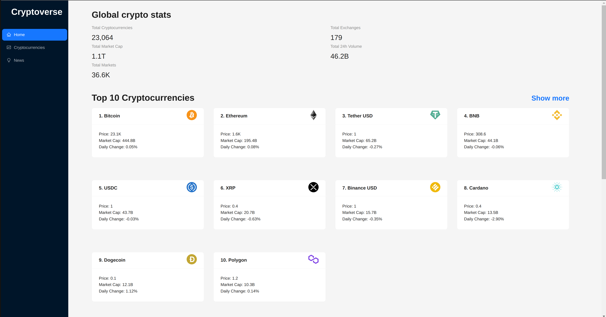
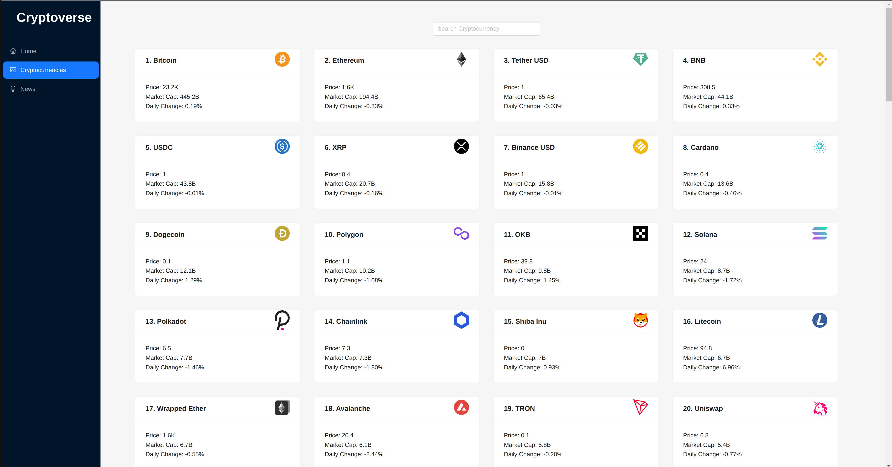
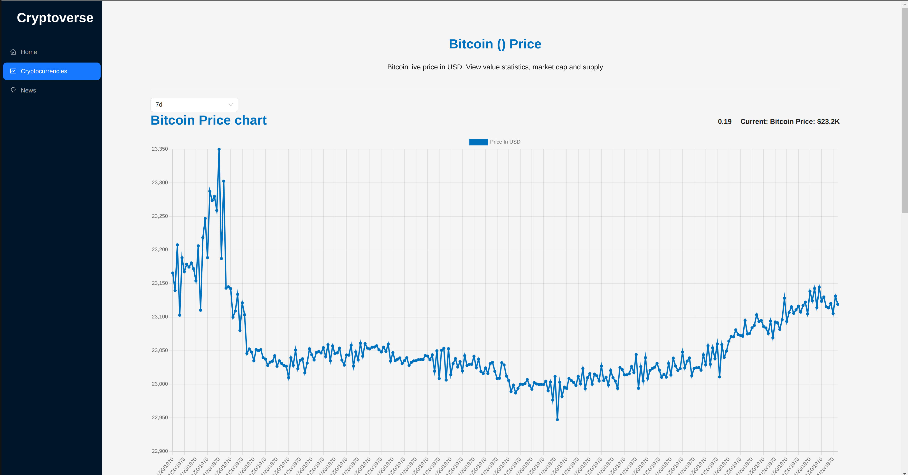

# Cryptoverse - A react application for cryptocurrencies.

This application views details and information for all cryptocurrencies in the world. Available with the features like search currency, news about cryptocurrencies and track prices of a coin.

This application specially demonstrates the usage of:

1. React router
2. Redux toolkit
3. Ant Design
4. Rapid API
5. React chart JS

## Steps to run

1. Clone the repository
2. Run npm install
3. Login to rapidapi.com. Search for coinranking and bing news search API and subscribe to them.
4. Create an .env file.
5. Copy the API KEY and HEADERS to the .env file.
6. Run npm start

## Available Scripts

In the project directory, you can run:

### `npm start`

Runs the app in the development mode.\
Open [http://localhost:3000](http://localhost:3000) to view it in your browser.
